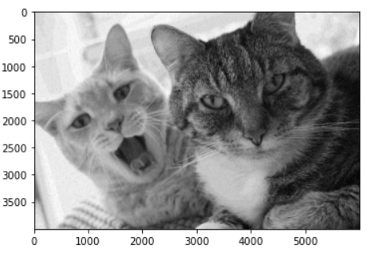

# COMP9517  COMPUTER VISION  LAB-01  YEAR: 2021 TERM: 01

# AIM

# QUESTION 1  Contrast Stretching

## OBJECTIVE 

- Read a grey scale image (cat.jpg) and perform contrast stretching to improve the quality of the image.

## IMPLEMENTAION

- Read the image "cat.png".
- Convert the image from BRG to RGB.
- Find min and max pixel values in the RGB format image.
- Apply the following formula given in the Lab specification document.

- where 
    - Or = original image.
    - Tr = transformed image.
    - a = min pixel values allowed in an image (8-bit image, a = 0).
    - b = max pixel values allowed in an image (8-bit image, b = 255).
    - c min pixel values in a given image.
    - d max pixel values in a given image.

- Convert it back to 8 bit image.
- Convert the image from BGR to RGB.

## RESULTS

# QUESTION 2  HISTROGRAM OF AN IMAGE

## OBJECTIVE

- Write a function that computes the histogram of the given grey scale image and displays a plot. Do NOT use built-in OpenCV functions for this purpose.

- Use this function to now create and plot a histogram for the original image and the contrast stretched image (output of question 1).

## IMPLEMENTAION

- Plot the original image and histrogram of the original image.

- Plot the contrast stretched image and histrogram of the contrast stretched image.

## RESULTS

### Original Image and Histrogram of the original image.

### Contrast Stretched Image and Histrogram of the contrast stretched image.

#  QUESTION 3  SMOOTHING FILTERS (LOW-PASS FILTERS) 

## OBJECTIVE

- Implement a mean filter, median filter and a gaussian filter (without using OpenCV 
functions). Perform noise removal on the output image from question 1 using these filters.

## IMPLEMENTATION

- Implement convolve2D operation.
- Define the mean filter matrix.
- Perform Convolve2D operation between Output Image of question 1 and Mean Filter.
- Implement median filter function.
- Implement Gaussian Matrix function.
- Perform Convolve2D operation between output image of question 1 and gaussain matrix.

## RESULTS

### Mean filter Output

### Median filter Output

### Gaussian filter Output

# QUESTION 4  Image Edges

## OBJECTIVE

- Use the median filter output image, use the Sobel operator to compute the image gradients 
at x and y directions.
- Note, that you should not use the built-in Sobel functions to do this, 
instead you should create the filters from scratch.

## IMPLEMENTATION

- Define the filters fx and fy
- Perform convolution between the median filter image and the fx.
- Perform convolution between the median fitler image and the fy.

## OUTPUTS

## Convolution between the median filter image and the fx.

## Convolution between the median filter image and the fy.

