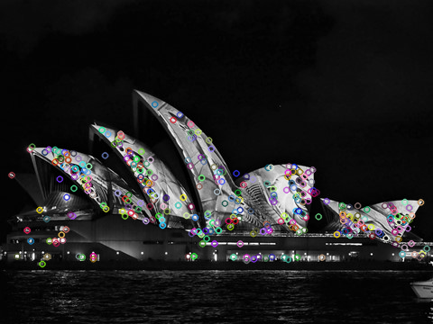
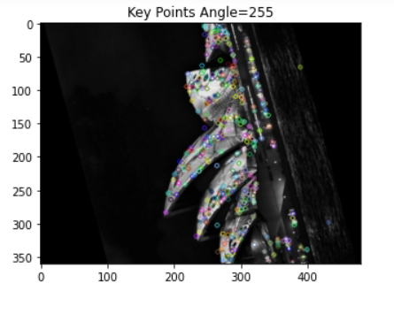
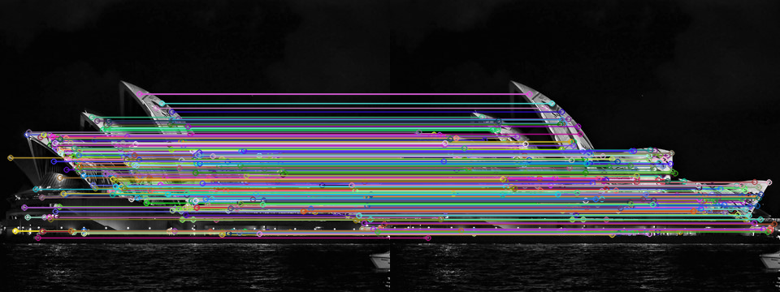
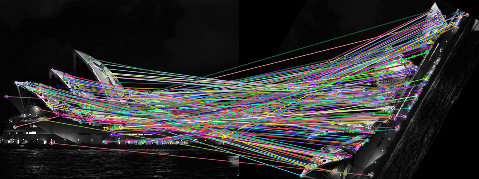
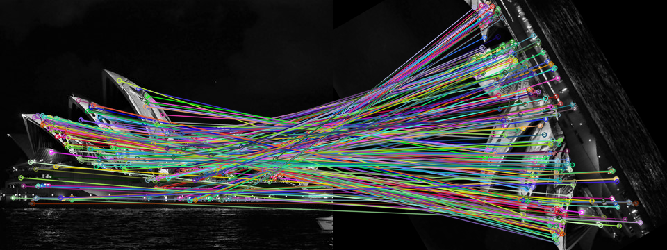

# COMP9517 COMPUTER VISION LAB-02 YEAR: 2021 TERM: 01

# AIM
- Learn and implement Scale Invariant Feature Transform features using OpenCV.

## TASK 1 Compute SIFT features

### OBJECTIVE

- Compute SIFT features.
- Rotate the number of keypoints extracted so that we get better visualisation of keypoints.
- Show these keypoints on the image. 
- Hint: vary the parameter 
“contrastThreshold” or “nfeatures” so that the number of keypoints becomes 
about 1⁄4 of all default keypoints).

### IMPLEMENTATION

- Read an image.
- converting the image color to gray-scale.
- creating sift feature with first default parameters which will be tuned.
- Draw Keypoints and Plot the keypoints on the image.

<table>
    <tr>
        <th colspan="2">SIFT Features HyperParameter</th>
    <tr>
    <tr>
        <td>Final nfeatures</td>
        <td>400</td>
    </tr>
</table>

### RESULT

## TASK 2 Rotate the image and compute the SIFT features again

### OBJECTIVE

- Rotate the image anti-clockwise by 255 degrees.
- Extract SIFT features and show the keypoints on the rotated image, using the 
same parameter settings as Task 1.

### IMPLEMENTATION

- Read the image.
- Calculate height, width and center of the image.
- Calculating the rotation 2D matrix using center point for angle (counter clockwise: -255).
- Plot the rotated image.
- Convert the rotated image to gray-scale image.
- Creaate the shift features using Task 1 parameters.
- Detect the keypoints from gray-scale image.
- Draw keypoints and plot the resulting image.

### RESULT

## TASK 3 Test rotational invariance of SIFT features

### OBJECTIVE

- Rotate the original image in increments of 60 degrees, from 0 to 120 degrees.
- For each rotated image, compute SIFT features and draw keypoints on the 
image.
- For each rotated image, match its SIFT descriptors with those from the original 
image based on the nearest neighbour distance ratio method.
- Draw the matches between the two images.

### IMPLEMENTATION

- Read the original image.
- Calculate height, width and center of the image.
- Rotate the image.
- Convert the original image to gray-scale.
- Convert the rotated image to gray-scale.
- Create the SHIFT features for the original and rotated image.
- Extract Keypoint and descriptors for the original gray scale image and the rotated gray scale image.
- Draw and plot keypoints on the rotated image.
- Use BFMacther L2_Norm with default parameters.
- Using the technique of KNN Matching with k = 2.
- Calculate the nearest neighbour distance ratio.
- Match the keypoints in the original and the rotated image using drawMatchesknn method from OpenCV.
- Plot the results.

### RESULTS

