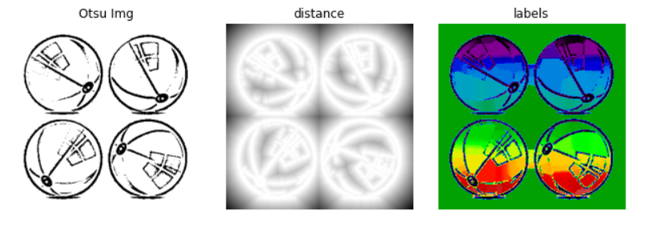
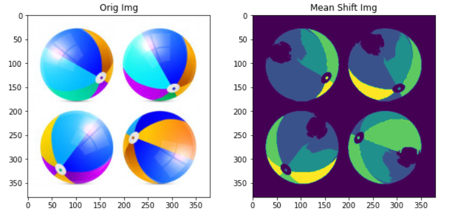
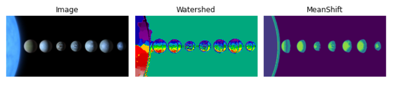

# COMP9517 COMPUTER VISION LAB-04 YEAR: 2021 TERM: 01

# AIM

- The aim of this lab is to perform image segmentation using Watershed and MeanShift methods.

# TASK 1 WATERSHED METHOD

## OBJECTIVE

- Perform image segmentation using Watershed method.

## IMPLEMENTATION

- Convert the image to grayscale.
- Take negative of the image since the background is white and foreground is non-white.
- Remove noise using median blur.
- Calculate histrogram so we can use image thresholding.
- I used Binary and Mean Adaptive thresholding methods but the final result looked better using Otsu's method.
- Calculate Distance Transform between background and objects.
- Find Markers and segment image using watershed method of scikit.
- Visualize and Plot the results of the distance transform.
- Plot the results.

## RESULTS

# TASK 2

## OBJECTIVE

- Perform image segmentation using MeanShift method.

## IMPLEMENTATION

- Read the image.
- flatten the image i.e. (h*w,3) shape.
- Estimate the bandwidth parameter value for MeanShift method using estimate_bandwidth.
- Declare Meanshift using estimate bandwidth.
- Training and Predictions.
- Plot the results.

## RESULTS

# TASK 3

## OBJECTIVE

- Perform image segmentation using Watershed and Meanshift methods.

## IMPLEMENTATION

- Read the input image and convert it to grayscale.
- Remove noise using median blur.
- Calculate histrogram so we can use image thresholding.
- I used Binary and Mean Adaptive thresholding methods but the final result looked better using Otsu's method.
- Perform Watershed and Meanshift methods to segment the image and plot the results.

## RESULTS

