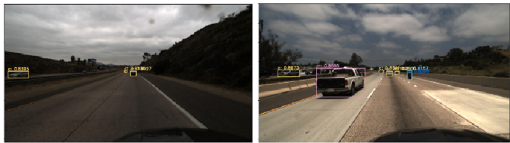

# COMP9517 COMPUTER VISION GROUP PROJECT

# AIM

# TASK 1 SELF DRIVING CARS DISTANCE CALCULATION

## OBJECTIVE
- Visual perception plays a critical role in achieving autonomous driving. Different types of information, such as the position and motion of the agents in the environment, play an important role in motion planning.

- For this task, implement a Python solution to estimate the distance of each vehicle relative to the camera in each image.

## DATASET

### INPUT DATA

- You will use the same dataset used in the individual component. The input should be the 40th frame file path in a clip.

## IMPLEMENTATION

- Run Yolo v3 for detection of cars and get bounding boxes.
- Implement tracker using euclidean distance to determine of a bounding box is the same one or different.

### Distance Prediction Model

- Extract the bounding box coordinates from the annotations files provided to us in the dataset.
- Create an 2-d (No.of example x 4) input matrix with columns/features as top, right, bottom and left coordinates of the bounding box.
- Extract the x and y component of the distance provided to us in the dataset.
- Create a 2-d (No.of example x 2) output/target matrix.
- Create a Multivariate Regression model using neural networks. (keras)
- Use the model to make distance predictions given an input image for all the detected cars in the image.
- Show distance x and y components on top of the bounding box.

#### Final Model

<table>
    <tr>
        <th colspan="4"><b>Model<b></th>
    </tr>
    <tr>
        <th>Layer No.</th>
        <th>Layer (type)</th>
        <th>Output Shape</th>
        <th>Param #</th>
    </tr>
    <tr>
        <td>1</td>
        <td>dense_7 (Dense)</td>
        <td>(None, 100)</td>
        <td>500</td>
    </tr>
    <tr>
        <td>2</td>
        <td>dense_8 (Dense)</td>
        <td>(None, 32)</td>
        <td>3232</td>
    </tr>
    <tr>
        <td>3</td>
        <td>dense_9</td>
        <td>(None, 2)</td>
        <td>66</td>
    </tr>
    <tr>
        <td colspan="5">Total params: 3,798</td>
        <td>Trainable params: 3,3798</td>
        <td>Non-trainable params: 0</td>
    </tr>
</table>

# TASK 2 SELF DRIVING CARS VECLOCITY CALCULATION

## OBJECTIVE

- For this task, implement a Python solution to estimate the velocity of each recognised vehicle.

## DATASET

### INPUT DATA

- You will use the same dataset used in the individual component. You need to estimate the velocity of each recognised vehicle in the 40th frame. You may use as many previous frames as you want for this task.

## IMPLEMENTATION

### Velocity Prediction Model

- Extract the bounding box coordinates from the annotations files provided to us in the dataset.
- Create an 2-d (No.of example x 4) input matrix with columns/features as top, right, bottom and left coordinates of the bounding box.
- Extract the x and y component of the velocity provided to us in the dataset.
- Create a 2-d (No.of example x 2) output/target matrix.
- Create a Multivariate Regression model using neural networks. (keras)
- Use the model to make velocity predictions given an input image for all the detected cars in the image.
- Show velocity x and y components on top of the bounding box.

#### Final Model

<table>
    <tr>
        <th colspan="4"><b>Model<b></th>
    </tr>
    <tr>
        <th>Layer No.</th>
        <th>Layer (type)</th>
        <th>Output Shape</th>
        <th>Param #</th>
    </tr>
    <tr>
        <td>1</td>
        <td>dense_10 (Dense)</td>
        <td>(None, 100)</td>
        <td>500</td>
    </tr>
    <tr>
        <td>2</td>
        <td>dense_11 (Dense)</td>
        <td>(None, 32)</td>
        <td>3232</td>
    </tr>
    <tr>
        <td>3</td>
        <td>dense_12</td>
        <td>(None, 2)</td>
        <td>66</td>
    </tr>
    <tr>
        <td colspan="5">Total params: 3,798</td>
        <td>Trainable params: 3,3798</td>
        <td>Non-trainable params: 0</td>
    </tr>
</table>

# RESULTS

