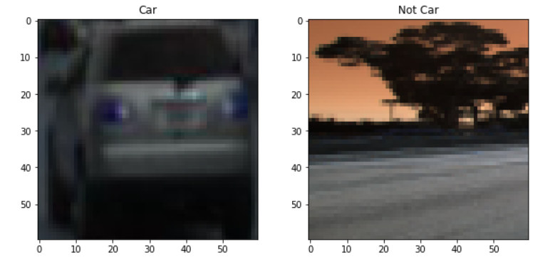
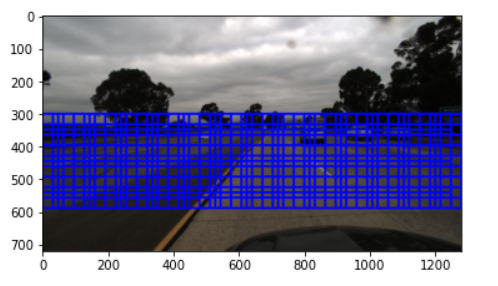
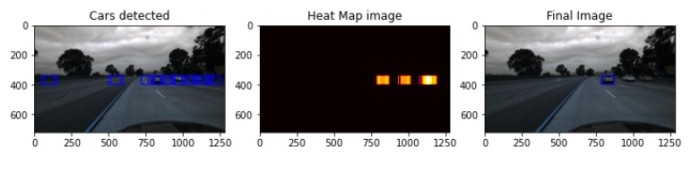

# COMP9517 COMPUTER VISION INDIVIDUAL PROJECT

# OBECTIVE

- For this component, you are required to detect vehicles in a given image. 
- Implement a Python solution to detect vehicles in a single (image frame).
- You should display bounding boxes around the recognised vehicles.
- You are required to use traditional feature extraction techniques from computer vision (hand-crafted or engineered features, and not deep learning features) to implement this task.
- As the ground truth files may only have labels for those vehicles that are near the camera, you need to have a criterion on how to handle this and achieve good results.

# DATASET

- For this project, TUSimple dataset is used.
- It was part of a competition released at the CVPR 2017 Workshop on Autonomous Driving Challenge.
- The competition had two challenges:
    - Lane Detection – contains about 7,000 one-second-long video clips of 20 frames each.
    - Velocity Estimation – a set of over 1,000 2-second-long video clips, with velocity and positions generated by range sensors on the last frame.

# INPUT DATA (INDIVIDUAL PART)

- For this task, we will use the Velocity Estimation Dataset and the associated human-annoted (labelled) bounding boxes.
- The input should be the 40 th frame file path in a clip.
- Use the associated .json file to extract the ground truth bounding box labels.

# IMPLEMENTATION

## STEP 1 Extract Positive Class Images (Cars)

- The first step that I performed was to extract positive class images from the images provided to us in the dataset.
- To do this we read the hand labelled annotation files provided to us.
- Also read the respective image related to the annotations file.
- Crop the car images from the original images and save them in positive car directory.
- I am only using the 40th frame of the video for training, testing and evaluation purposes.
- To crop the positive class images, I am extracting the top, left, right, bottom coodinates of the annotated box from annotation images and use these coordinates to crop the image.
- I am also resizing the cropped image to 60 * 60 so that all the images of positive class which is cars are of the same size and it will also improve the performance of the model in detecting the cars in the image.
- Creating a dataset of positive class car images extracted from the dataset will also help us to incorporate the domain knowledge for our model.

## STEP 2 Extract Negative Class Images (Not Cars)

- The second step that I performed was to extract negative class images from the images provided to us in the dataset.
- To do this, read the annotation files which were created by me using the superannotation software.
- Negative class contains cropped images of anything in the original image not containing cars. 
- Also read the respective image related to the annotations file.
- Crop the negative class image from the original images and save them in negative class directory.
- 40th frame of the video is again used for training, testing and evaluation purposes.
- To crop the negative class images, I am extracting the top, left, right, bottom coodinates of the annotated box from annotation images and use these coordinates to crop the image.

- I am also resizing the cropped image to 60 * 60 so that all the images of negative class which is images of all other things except cars are of the same size and it will also improve the performance of the model in detecting the cars in the image.

## STEP 3 CAR DETECTION MODEL
- I am implementing the model as a binary classification problem and using SVM to predict if the images contains a car or not.
- Load the car and negative class images from the directories created in the previous steps.
- Total Number of positive examples (cars): 1442.
- Total Number of negative examples (non car): 1014.
- Shape of a single positive example : 60x60x3.
- Shape of a single negative example : 60x60x3.

### Example of Positive and Negative Class images

- Calculate HOG features of all the positive and negative class images.
    - The image was first converted to YCrCb.
    - HOG Feature was calculated separatly for each channel and then combined.
    - The above gave better results of HOG features which also helped to increase the performance of the model.
    - Shape of HOG feature for a single image is 3 * 81. (shape of Hog_Features_L C * Hog Features of the Color channel).
    - After calculating the HOG feature for all the positive class images, the shape of the car features is 1442 x 243 which is no_of_images * hog_features.
- Create the input matrix for the SVM model by stacking the positive and negative classes numpy arrays so that the final shape of input is 2456x243 which is (no of cars and not cars images) * (hog fearures of images).
- Next we will normalize the input matrix using the StandardScaler. (mean = 0, variance = 1)
- Create the output/target matrix for the model by stacking numpy 1-D array of ones on top of a numpy 1-D array of zeros.
- Split the dataset into train and test datasets. (train_size = 0.8, test_size = 0.2)
- Declare the SVM model.
- Train and evaluate the model on test data.
- Use sliding window to create bounding boxes around the detected cars.
    - we will set some parameters to only search the 300 - 600 px range in the y axis and different values for xy size of window to improve the performance of the model and reduce false positives. The reason for setting the y axis range of  300 - 600 because anything above 300px is the sky region and no car is going to be present their and anything lower than 600px will be ignored as the have left the view of the car.
- Use the heatmap approach to further reduce the false postive windows detected by the model.
    - add 1 to all the pixels of the bounding boxes and set a threshold value to turn the pixels to zero which are under that threshold.

# RESULTS

<h2>Test Accuracy : 0.9736<h2>

